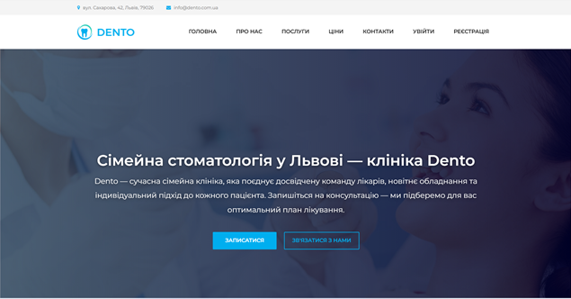
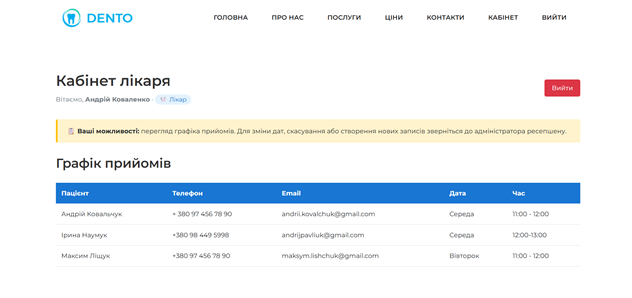
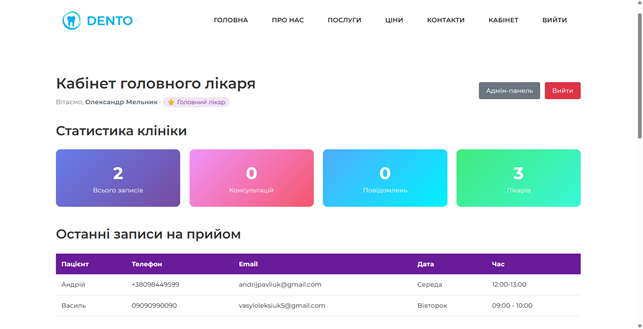
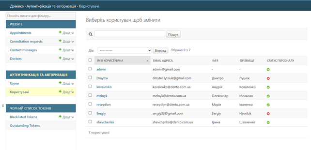
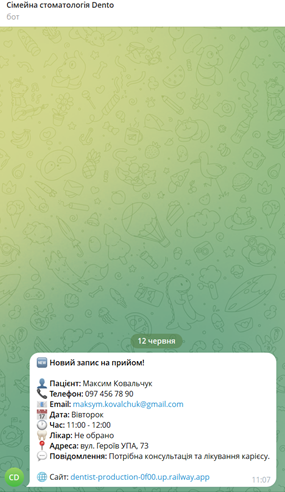

# Dento Clinic

Dento Clinic is a web application developed for managing
a dental clinic using Python and Django.

The project was developed as my bachelor's diploma project
and focuses on patient management, appointments,
authentication and communication between clinic staff and patients.

## Features

- User registration and email verification
- Role-based access control
- Doctor, receptionist and patient roles
- Appointment management
- Administrative panel
- Telegram notifications
- Email verification
- Patient and doctor management
- SEO optimization
- Responsive web interface

## Technologies

- Python
- Django
- PostgreSQL
- HTML
- CSS
- JavaScript
- REST APIs
- Telegram Bot API
- Resend API

## Architecture

The application uses Django's MTV architecture and
Django authentication and authorization mechanisms.

Different user roles have access to different parts
of the system.

## My contribution

I designed and developed the application, including:

- Backend development with Django
- Database models and relationships
- Authentication and authorization
- Appointment management
- Telegram bot integration
- Email verification
- Administrative functionality
- SEO implementation
- Deployment configuration

## Screenshots

### Homepage

### Patient Dashboard

### Chief Doctor Dashboard

### Admin Panel

###   Telegram Notifications

## Project Status

The project was developed as a bachelor's diploma project.

The application is currently being prepared for further deployment.
